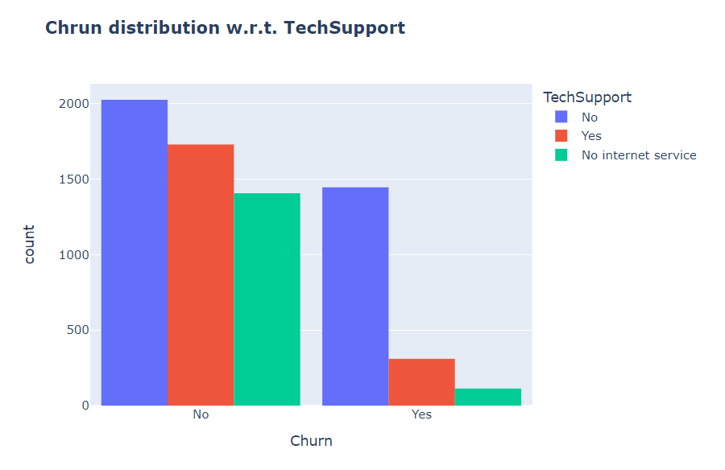

# 📉 Customer Churn Analysis

An end-to-end data analysis and machine learning project focused on understanding customer behavior and predicting churn in the telecom industry. The project explores the factors responsible for customer attrition through exploratory data analysis and builds predictive models to identify customers who are likely to leave.

---

## 🚀 Project Overview

Customer churn is one of the biggest challenges faced by telecom companies. Acquiring new customers is significantly more expensive than retaining existing ones.

This project aims to:

* Analyze customer behavior patterns
* Identify important factors contributing to churn
* Visualize relationships between customer attributes and churn
* Build machine learning models for churn prediction
* Provide insights that can help improve customer retention strategies

---

## 📂 Dataset

**Dataset:** Telco Customer Churn Dataset

The dataset contains information about:

* Customer demographics
* Services subscribed
* Contract information
* Billing and payment methods
* Monthly and total charges
* Customer tenure
* Churn status

---

## 🛠️ Technologies Used

* Python
* Pandas
* NumPy
* Matplotlib
* Seaborn
* Scikit-Learn
* Jupyter Notebook

---

## 📊 Exploratory Data Analysis

Several factors influencing customer churn were analyzed:

* Gender distribution
* Dependents
* Partner status
* Senior citizens
* Internet services
* Online security
* Tech support
* Payment methods
* Total charges
* Monthly charges
* Customer tenure

The visualizations generated during EDA provide valuable insights into customer behavior and reveal patterns associated with customer attrition.

---

## 📈 Key Insights

* Customers with month-to-month contracts show higher churn rates.
* Electronic check users are more likely to leave.
* Lack of online security and tech support is strongly associated with churn.
* Customers with higher monthly charges tend to churn more frequently.
* New customers are at greater risk of leaving compared to long-term customers.
* Fiber optic internet users exhibit relatively higher churn rates.

---

## 🤖 Machine Learning Models

Different classification algorithms were evaluated, including:

* Logistic Regression
* K-Nearest Neighbors (KNN)
* Naive Bayes
* Decision Tree
* Random Forest
* AdaBoost
* Gradient Boosting
* Voting Classifier

The final ensemble model combines multiple algorithms to achieve better predictive performance.

---

## 📁 Project Structure

```
Customer-Churn-Analysis/
│
├── data/
├── output/
├── notebooks/
├── Customer_Churn_Analysis.ipynb
├── README.md
└── requirements.txt
```

---

## 📸 Sample Visualizations

### Customer Churn Distribution


### Internet Services Analysis


### Tech Support vs Churn



### Payment Methods


---

## 🎯 Future Improvements

* Hyperparameter tuning
* Feature engineering
* Cross-validation optimization
* Deployment using Flask or Streamlit
* Interactive dashboard integration

---

## 👨‍💻 Author

### Krishna Sharma

AI & Machine Learning Enthusiast

🔗 LinkedIn:
https://www.linkedin.com/in/sharmakrishnaa

🔗 GitHub:
https://github.com/Krishnaxgithub
